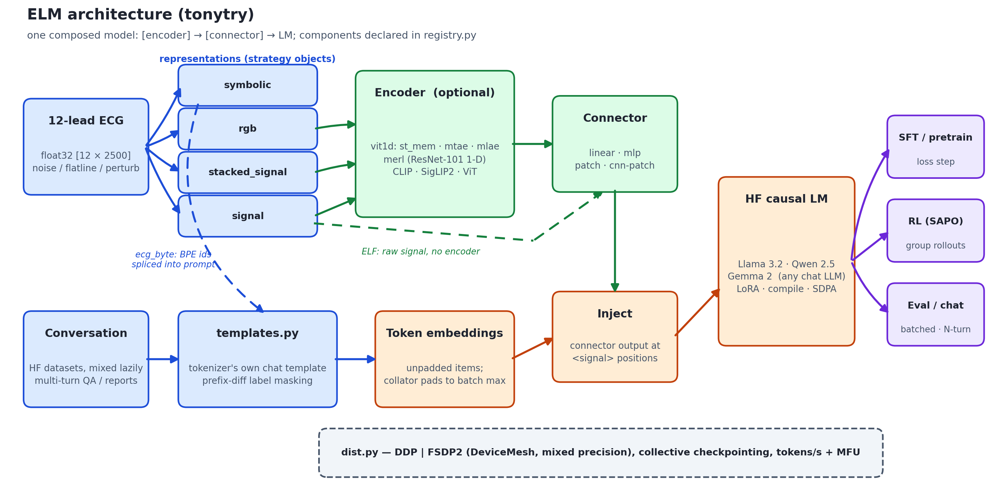
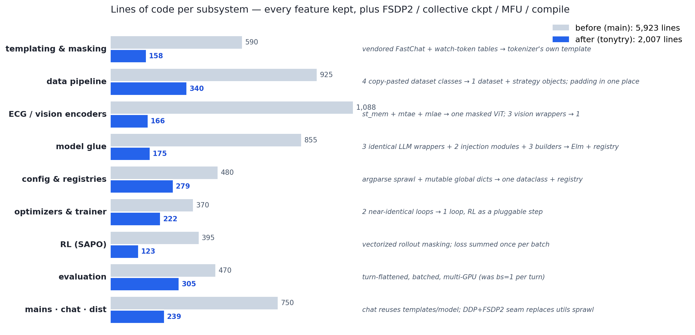

# ELM `tonytry` — the framework, rebuilt from scratch

A ground-up rewrite of the ELM training/eval framework on an orphan branch:
**every feature of the original, plus FSDP2 / collective checkpointing /
mixed-precision policy / MFU telemetry / first-class `torch.compile`, in
2,007 lines of `src/` Python versus 5,923 before (−66%).** `PLAN.md` holds the
milestone gates; `tests/` is the 40-test gate suite that every milestone had
to pass before the next began.

<p align="center">
  
</p>

<p align="center">
  
</p>

## The structure, before and after

### Before (`main`, 5,923 lines) — components duplicated per variant

```
configs/config.py ───── 97   argparse, 60+ flags
configs/constants.py ── 385  HF_LLMS/ENCODERS dicts ··· mutated at runtime as a
                             side-channel between builders; watch-token id tables
                                          │
dataloaders/                              ▼
  dataset_mixer.py ──── 142  ──▶ if/elif over representations
  build_dataloader.py ─ 115      materializes whole HF dataset into RAM
  data_representation/
    base.py ─────────── 321  ◀─┐ label masking via per-model watch-token
    signal.py ───────── 94   ──┤ id sequences
    stacked_signal.py ─ 101  ──┼── prepare_training_set / prepare_eval_set /
    rgb.py ──────────── 123  ──┤   trunc_pad_input COPY-PASTED ×3 (+variant ×1);
    symbolic.py ─────── 108  ──┘   every item padded to 2048
  bpe/ecg_byte.py ───── 83
utils/chat_template_manager.py ─ 428  vendored FastChat (3 of ~20 templates used)

elms/
  build_elm.py ──────── 64   ──▶ build_llm.py 107 ──▶ llama3.py ── 37 ┐
  connect_nns.py ────── 100      (if/elif by name)   qwen25.py ── 37 ├ IDENTICAL ×3
  build_encoder.py ──── 135  ──▶ (if/elif by name)   gemma2.py ── 37 ┘
  ecg_encoders/
    st_mem.py ────────── 422 ┐ three masked-ViT files sharing blocks
    mtae.py ──────────── 224 ├ by cross-import + subclass-override
    mlae.py ──────────── 197 ┘
    merl/ ────────────── 169   (+ unused AttentionPool2d, 4 unused resnets)
  vision_encoders/ ───── 76    hf_clip / hf_siglip / hf_vit, near-identical ×3
  connectors/ ────────── 153   4 connectors, dtype frozen at construction
  llm_encoders/
    llava.py ─────────── 95  ┐ inject_projected_embeds + freeze + generate
    base_elf.py ──────── 89  ┘ COPY-PASTED ×2

optimizers/optimizer_setup.py ─ 219   schedule counted in the wrong step unit
runners/
  trainer.py ──────── 75      rl_trainer.py ── 77   (≈same loop ×2)
  evaluator.py ────── 392     bs=1, one generate() per turn
main_trainer.py ───── 92   main_evaluator.py ── 80   main_chat.py ── 233
                                                     (re-implements tokenizer
                                                      setup, EOS sets, decode)
utils/ ────────────── ~600   gpu/checkpoint/dir/seed/time/viz/wandb managers
                             (+ dead: timeit, log_wandb, plot_signals, …)

  "needs signal injection?"  ──▶  hand-written ELM-name lists in 3 places,
                                  all three disagreeing
```

### After (`tonytry`, 2,007 lines) — one component per concept, wired one way

```
                 config.py 165                registry.py 114
        one dataclass = the CLI        LLMS · ENCODERS · ELMS · CONNECTORS
        (validated against ──────────▶ REPRESENTATIONS — every dispatch
         the registry)                 in the codebase reads THIS
              │                                  │
   ┌──────────┴───────────┐          ┌───────────┴──────────┐
   ▼                      ▼          ▼                      ▼
 data/                              models/
  templates.py 158   tokenizer's own chat     encoders/vit1d.py 104  st_mem|mtae|mlae
   │                 template + prefix-diff   encoders/merl.py   40  as ONE masked ViT
   │                 masking (any HF model)   encoders/hf_vision.py 22
   ▼                                                  │
  dataset.py 173     lazy HF mixing; items            ▼
   │ ▲               UNPADDED; representations =      connectors.py 60
   │ └ images.py 78    15-line strategy objects               │
   │   bpe_tokenizer.py 31                                    ▼
   ▼                                          elm.py 115  ONE composed module:
  collate.py 58      ALL padding lives here   [encoder] ─▶ [connector] ─▶ HF LM
   │                 (batch-max, ×8)          (llava / elf / ecg_byte = which
   │                                           parts are None)
   └──────────────┬───────────────────────────────┘
                  ▼
        ┌─────────────────────┐     dist.py 90   the parallelism seam:
        │ train/trainer.py 151│◀────  DDP | FSDP2, mesh, rank helpers,
        │   optim.py  71      │       collective ckpt gather
        │   rl.py     123     │
        ├─────────────────────┤
        │ evaluate.py 195     │  flatten turns ─▶ batched generate ─▶
        └─────────────────────┘  shard ▷ gather ▷ score   (reuses collate.py)
                  ▲
   main_train 65 ─┴─ main_eval 110 ── main_chat 84   (chat reuses templates +
                                                      elm; zero duplicated logic)
```

The shape difference is the point: the old graph has clusters of boxes doing
the same job (×3 LLM wrappers, ×4 dataset methods, ×2 injection modules,
×3 disagreeing dispatch lists) and arrows that flow *sideways* through mutable
global dicts. The new graph is a DAG — registry and config at the top, one
box per concept, and the answer to "where does X live?" is always exactly one
file.

## Setup

```bash
uv sync
cd src/data/bpe && maturin develop --release   # once, for --representation symbolic
```

Preprocessed `.npy` data lives in `../data/` next to the repo (the HF
datasets' `ecg_path` fields are relative to the repo root).

## Train

```bash
# single GPU
uv run src/main_train.py \
  --data ecg-qa-ptbxl-250-2500 --representation signal \
  --llm qwen2.5-1.5b-instruct --elm mlp_llava --encoder st_mem \
  --num_encoder_tokens 50 --update connector llm --lr 1e-4

# multi-GPU: DDP or FSDP2 — distributed mode is auto-detected from torchrun
torchrun --standalone --nproc_per_node=4 src/main_train.py ... --parallel fsdp

# phases: --train_phase pretrain | sft | rl    (rl = SAPO, see --rl_* flags)
```

Runs land in auto-numbered `runs/<elm>_<llm>_<encoder>/<data>/<n>/` with a
`config.json`, `best`/`last`/step checkpoints, and a `DONE` marker. Every CLI
flag is a field of `Config` in `src/config.py`; components are declared in
`src/registry.py` — adding an LLM, encoder, ELM composition, or representation
is one entry there.

## Evaluate / chat

```bash
[torchrun ...] uv run src/main_eval.py --data ... --ckpt runs/.../best \
  --eval_batch_size 8        # batched + multi-GPU N-turn eval, multi-seed stats
uv run src/main_chat.py --ckpt runs/.../best --elm patch_elf --num_encoder_tokens 100
```

## Verification

Every milestone shipped behind a gate (see `PLAN.md`): masks decode to exactly
the assistant turns on real data; training demonstrably learns; cosine/warmup
schedules hit their endpoints under gradient accumulation; FSDP2 and
distributed eval run under real `torchrun`; 40/40 tests. Feature parity with
`main` was audited flag-by-flag and behavior-by-behavior (twice, the second
pass by an independent reviewer-agent), and the few deliberate divergences are
documented in the audit commit (`64ddca1`).
